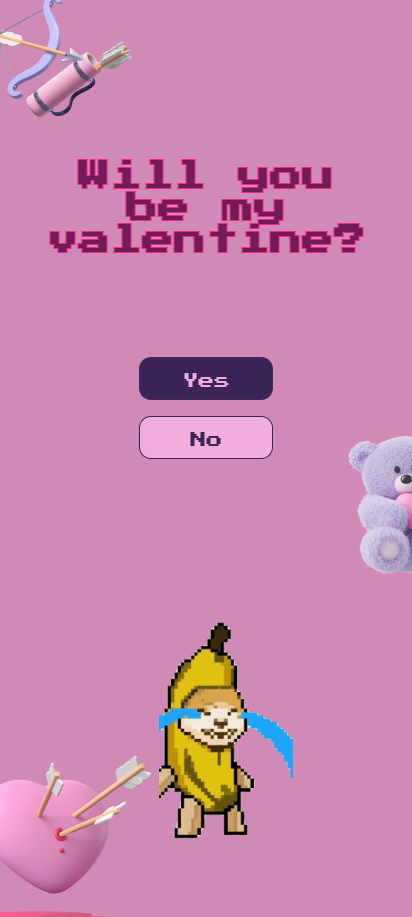
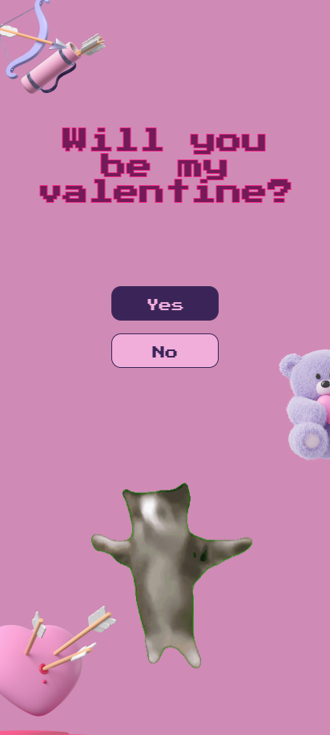
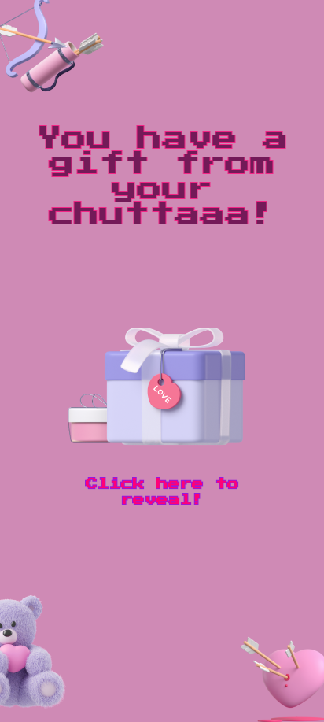

# Will you be my Valentine (2025)

### A minimalistic and simple but joyful digital present for your significant other.

This project is a digital gift that you can customize with your own images and messages. It includes animations, interactive elements, and a playful design to make your gift special.

- Simply replace the images in the `/public/public/assets/` directory with your own.
- Any improvements are happily welcomed. Feel free to contribute.

## Features

- **Interactive Gift Box**: Click to reveal a surprise.
- **Funny Sound Feedbacks**: Enjoy the famous cat meme sound effects.
- **Heart Rain Animation**: Falling hearts to set the mood.
- **Confetti Animation**: Celebrate with a burst of confetti.
- **Customizable Messages**: Personalize the messages displayed.

<div>
  
  
  
</div>

## Getting Started

1. Clone the repository:

   ```sh
   git clone https://github.com/KaSaNaa/will-you-be-my-valentine.git
   ```
